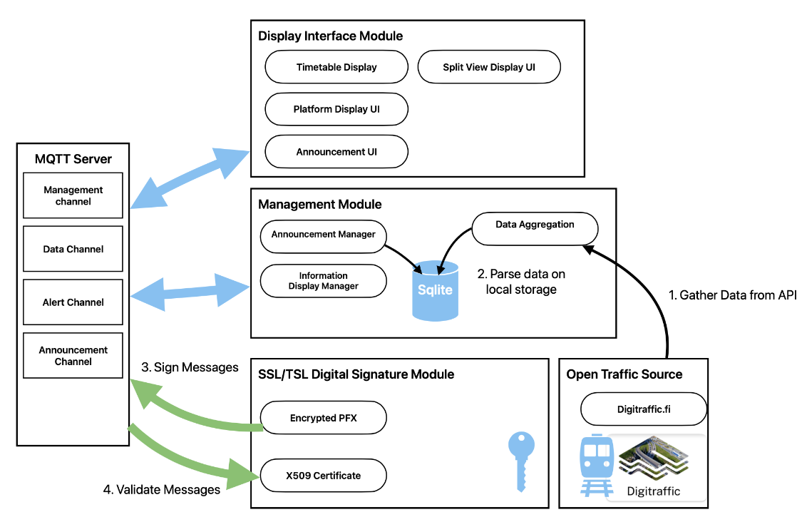
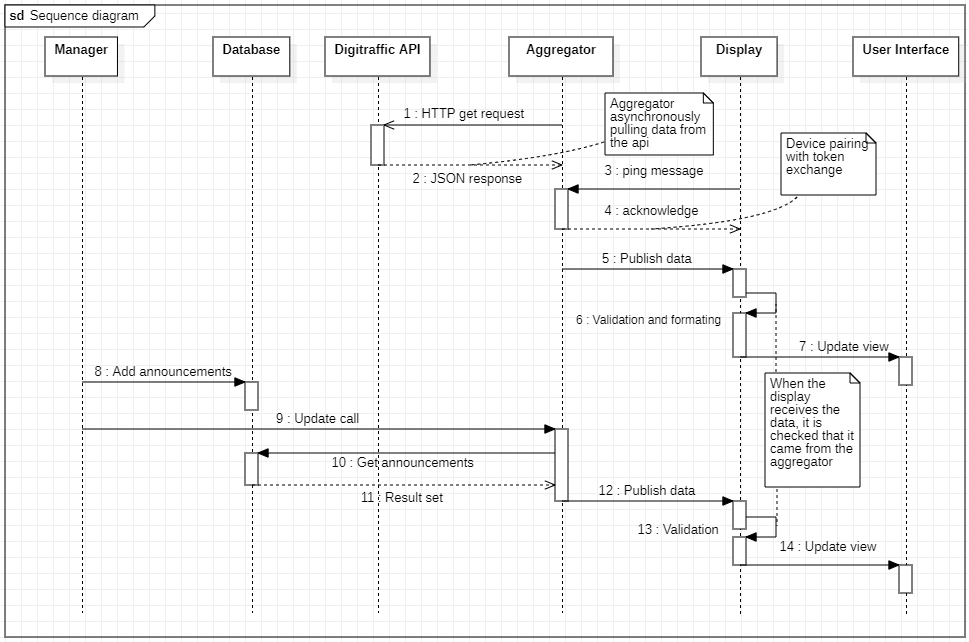
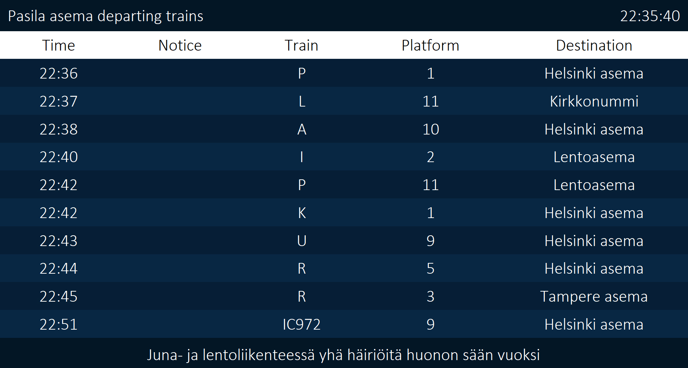
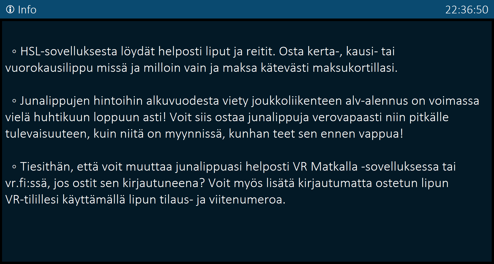
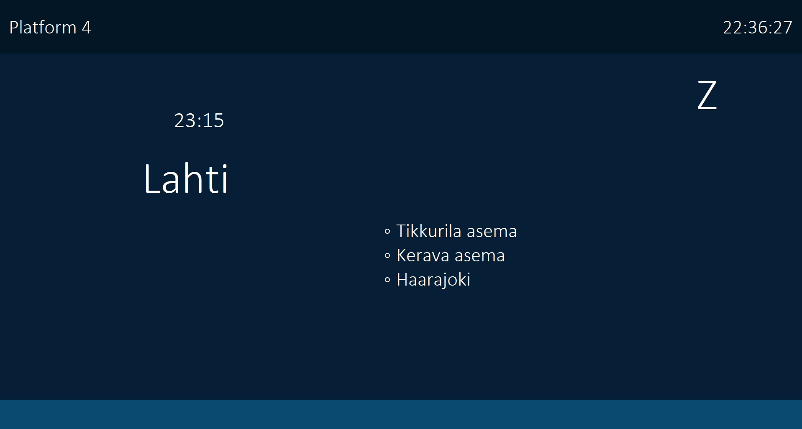
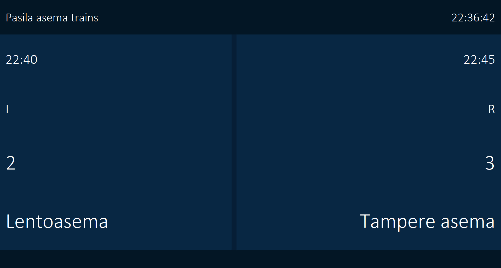
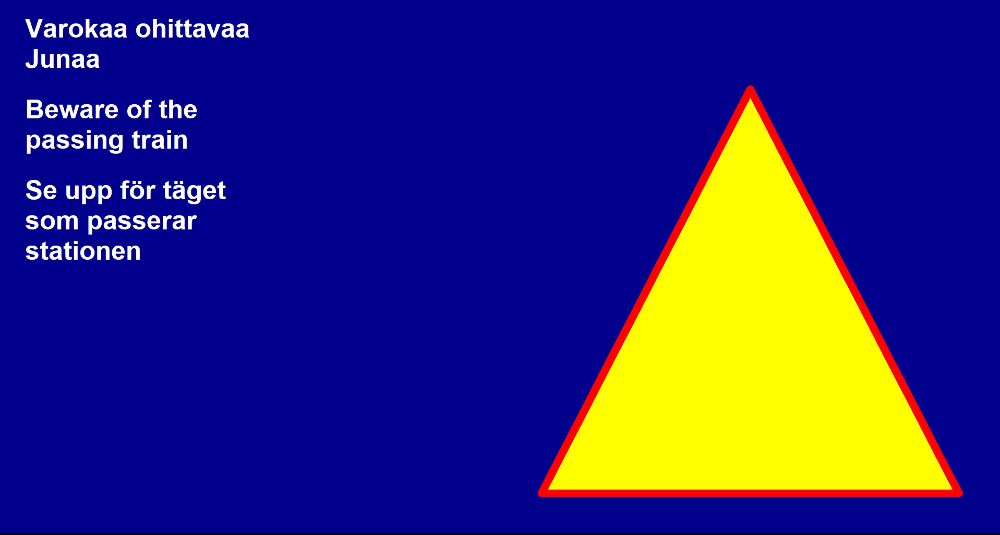
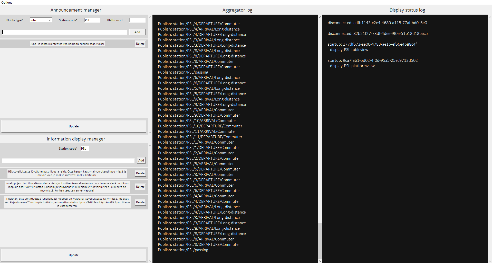

# Platform information system  
  
#### ✨Developed at Metropolia's innovation project course for a client at Nokia.✨  
  
 By. Leevi Laaksonen, Samuel Laisaar, Leo Lehtiö, Aleksandr Liski  
The goal of this project is to develop a train station display board system. 
 The system provides the possibility to handle multiple displays at various different train stations. 
 These displays can be, for example, a central display that shows information of all trains departing at the station and displays on individual platforms. 
 The displays can be configured with arguments to specify if, for example, the user wants to display only trains that are arriving and which are also commuter trains 
  
## Architecture  
  
The management node which is running the aggregator retrieves rail traffic data from Digitraffic's services and uses MQTT protocol to distribute the data to different topics which the displays at railway station's can subscribe. In the display's implementation the data is then validated, formatted and then displayed in with a GUI.

### System overview
  

### Sequence diagram
  
  
> - Sequence starts asynchronously from steps 1 to 2
> 1. Aggregator fetches data from Digitraffic.
> 2. Digitraffic responds with JSON data that is filtered and published at step 5. Since the operation is asynchronous, data is published regardless whether any display is running.
> - From step 3 to 4, the display is selected to start
> 3. Display sends a ping event that includes a public key identifying itself for the Aggregator.
> 4. Aggregator sends an acknowledgment message with its public key.
> 5. Aggregator publishes the fetched train data to their corresponding topics.
> 6. Display verifies that the data has come from the aggregator and not from any external will. 
   > After that, the data is formatted into a form that the user interface can display
> 7. The User interface updates its view as it receives the formatted data.

### MQTT topic naming convention  
Topic for train data
```sh  
station/<station-short-code>/<platform-number>/<transit>/<transport-type>
```  

> Transit: **DEPARTURE** or **ARRIVAL** 
> Transport type: **Commuter** or **Long-distance**

> **Outputs a JSON string:**  [{stationFullName, schedule: [{Train:[trainNumber, trainType, trainCategory, commuterLineID, timetable: [destination, type, cancelled, scheduledTime, differenceInMinutes, liveEstimateTime, commercialTrack, trainStopping, cause, stops_on_stations:[]]]}]}]
>   
Topic for announcements in a station
```sh  
announcements/<notify-type>/<station-code>/<platform-id>
```  

> Notify type: **info**, **alert**, **infoview** or **passing** 

Topic for device communication
```sh  
management/<display-id>/update
```  
> Subtopic **"update"** not mandatory and is used only for notifying the aggregator to publish data from a database
## Installation  
  
For running the build on Linux (ubuntu, raspbian):

Before installing anything make sure operating system is up to date.

Check that your python version is at least 3.9
```sh  
python3 --version
```
Make sure you have git and pip installed
```sh  
sudo apt-get update
sudo apt install git 
sudo apt install python3-pip
```  

If your python doesn't come with built-in tkinter package install it
```sh  
sudo apt-get install python3-tk
```  
Install Eclipse Mosquitto  
```sh  
sudo apt-add-repository ppa:mosquitto-dev/mosquitto-ppa  
sudo apt-get update  
sudo apt-get install mosquitto  
sudo apt-get install mosquitto-clients  
```  
Start the broker  
```sh  
mosquitto  
```  
### With pip:

It's recommended to use a Python virtual environment
So create one and activate it
```sh  
python3 -m venv develop
source develop/bin/activate 
```  
Install the program with pip
```sh  
python3 -m pip install git+https://github.com/InnovationProject4/platform-info-system.git
```  
After the installation initialize the necessary config files:
```sh  
pis init
```
#### Starting up the wizard
```sh  
pis
```
> With the wizard you can
> - Start the display and aggregator with easy step by step instructions
> - Edit the configuration file that includes the brokers IP, port and option to run displays on fullscreen
> - Uninstall the program

#### Starting up the manager
```sh  
pis-dashboard
```
#### Starting up the display
```sh  
pis-display -view <display_view> -s <station_short_code> -p <platform> -left <platform> -right <platform> -transit<transit> -transport<transport>
```
> Explanation for the arguments:  
> -view "tableview" requires the argument -s but -p, -transit and -transport are optional  
> -view "splitview" requires arguments -s, -left, -right but -transit and -transport are optional  
> -view "platformview" requires arguments -s and -p but -transit and -transport are optional  
> -view "infoview" requires only the argument -s\
> -transit accepts either "departures" or "arrivals"\
> -transport accepts either "commuter" or "long_distance" 
#### Starting up the aggregator
```sh  
pis-aggregator <station_short_code> <station_short_code> ...
```  
> Aggregation of several stations is possible if you separate them with spaces.
### With git clone:

Clone the repository with git  
```sh  
git clone https://github.com/InnovationProject4/platform-info-system  
```  
Navigate to the "src" folder
```sh  
cd platform-info-system/src
```  
Set up an environment variable
```sh  
export PYTHONPATH=pis/:$PYTHONPATH
```  
initialize the necessary config files:
```sh  
python3 pis/install/wizard.py init
```
#### Starting up the wizard
```sh  
python3 pis/install/wizard.py
```
#### Starting up the manager
```sh  
python3 pis/manager_client.py
```
#### Starting up the aggregator
```sh  
python3 pis/aggregator.py <station_short_code> <station_short_code> ...
```
#### Starting up the display
```sh  
python3 pis/display_client.py -view <display_view> -s <station_short_code> -p <platform> -left <platform> -right <platform> -transit<transit> -transport<transport>
```

> See the installation "with pip" for explanation for all the arguments

## Screenshots

<table>
  <tr>
  	<td align="center">
      
    </td>
    <td align="center">
      
    </td>
  </tr>
  <tr>
  	<td align="center">
      
    </td>
    <td align="center">
      
    </td>
  </tr>
  <tr>
  	<td align="center">
      
    </td>
    <td align="center">
      
    </td>
  </tr>
</table>