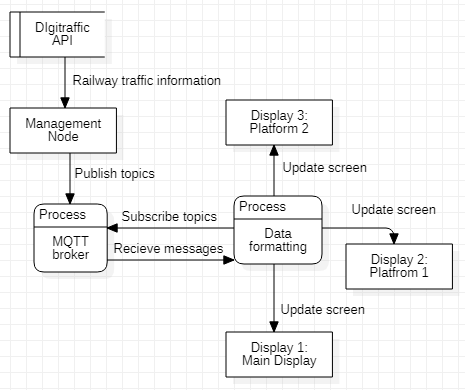

# Platform information system

#### ✨Developed at Metropolia's innovation project course for a client at Nokia.✨

    By. Leevi Laaksonen, Samuel Laisaar, Leo Lehtiö, Aleksandr Liski

The goal of this project is to develop a train station display board system. The system provides the possibility to handle multiple displays at various different train stations. These could be for example the main display that shows information of all trains departing at the station and displays on individual platforms.

## Architecture

The system retrieves rail traffic information from Digitraffic's services and uses MQTT protocol to distribute the information to different displays at railway stations.



### MQTT topic naming convention
Data for main display
```sh
station/<station-short-code>/main
```
> **Outputs a JSON string:** 
> {station, trains: [train, trainType, trainCategory, commuterID, time, actualTime, notice, platform, destination]}

Data for individual platform
```sh
station/<station-short-code>/<platform-number>
```
> **Outputs a JSON string:** 
> {platform, trains: [train, trainType, trainCategory, commuterID, time, actualTime, notice, platform, destination]}
> 
Data for non stopping trains at a platform
```sh
station/<station-short-code>/<platform-number>/passing
```
> **Outputs a JSON string:** 
> {station, trains: [track, scheduledTime]}
> 
Notification alert for individual station
```sh
station/<station-short-code>/notification
```
Warning alert for individual station
```sh
station/<station-short-code>/warning
```

## Installation

For running the build locally on Linux

Install Eclipse Mosquitto
```sh
sudo apt-add-repository ppa:mosquitto-dev/mosquitto-ppa
sudo apt-get update
sudo apt-get install mosquitto
sudo apt-get install mosquitto-clients
```

### Displays

Clone the repository with git
```sh
git clone https://github.com/InnovationProject4/platform-info-system
```
Then navigate to the "build" folder.

You will need to install the requirements.txt file for running displays:
```sh
pip3 install -r requirements.txt
```
The display can be executed with the command:
```sh
python3 client.py -view <display_view> -s <station_short_code> -p <platform> -left <platform> -right <platform>
```
> Here is an explanation of the different parameters:\
> -type "tableview" requires the parameter -s but -p is optional\
> -type "splitview" requires parameters -s, -left, -right\
> -type "platformview" requires parameters -s and -p
